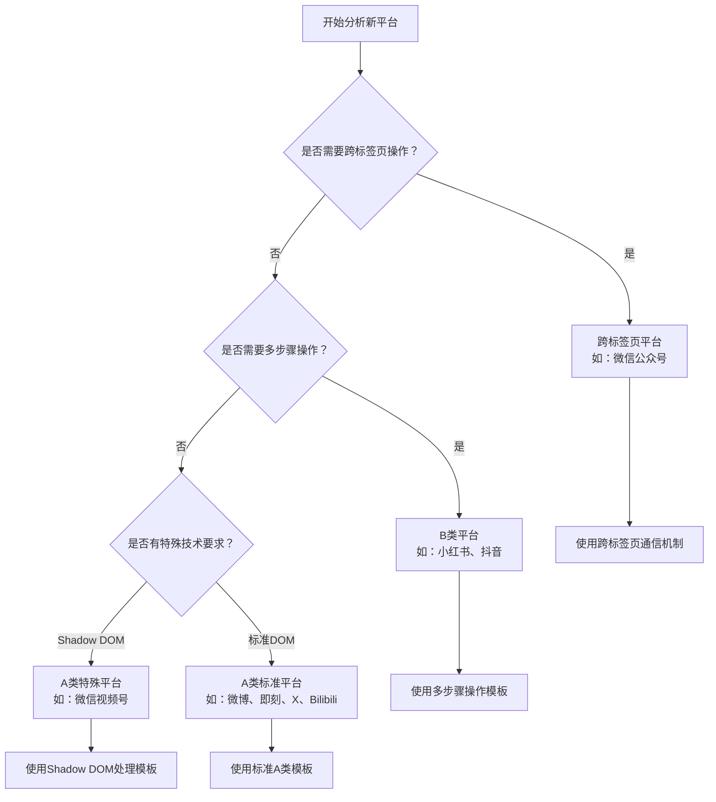

# MomentDots 新平台开发指南

**版本：** v2.1
**更新日期：** 2025-01-21
**作者：** MomentDots 开发团队

## 📋 目录

1. [开发流程概述](#开发流程概述)
2. [平台分类决策](#平台分类决策)
3. [A类平台开发指南](#a类平台开发指南)
4. [B类平台开发指南](#b类平台开发指南)
5. [跨标签页平台开发指南](#跨标签页平台开发指南)
6. [代码规范和质量标准](#代码规范和质量标准)
7. [测试验证流程](#测试验证流程)
8. [部署和维护](#部署和维护)

## 🚀 开发流程概述

### 新平台开发的标准流程

```
需求分析 → 平台分类 → 选择模板 → 实现适配器 → 配置管理 → 测试验证 → 代码审查 → 部署上线
```

### 开发前准备

1. **环境准备**
   - Chrome浏览器开发者版本或Canary版本
   - MomentDots项目源码
   - 目标平台的测试账号
   - Node.js v16.0+（用于构建和测试）
   - Playwright MCP Bridge（用于自动化测试）

2. **技术调研**
   - 分析目标平台的发布流程和用户界面
   - 识别关键DOM元素和CSS选择器
   - 了解平台的特殊技术要求（如Shadow DOM、跨域限制等）
   - 检查平台是否使用特殊框架（如React、Vue、微前端等）
   - 分析文件上传机制和限制

3. **架构分析**
   - 确定平台分类（A类/B类/跨标签页）
   - 选择合适的基类和开发模板
   - 规划配置结构和选择器策略
   - 评估是否需要特殊处理（如Shadow DOM穿透）

## 🎯 平台分类决策

### 决策流程图



### 平台特征识别表

| 特征 | A类标准 | A类特殊 | B类 | 跨标签页 |
|------|---------|---------|-----|----------|
| **页面跳转** | 无 | 无 | 有 | 有 |
| **DOM访问** | 标准DOM | Shadow DOM | 标准DOM | 标准DOM |
| **操作步骤** | 1步 | 1步 | 多步 | 多步 |
| **文件上传** | 标准API | DataTransfer | 标准API | 标准API |
| **通信机制** | 内容脚本 | 内容脚本 | 内容脚本 | Background Script |

### 分类判断标准

#### A类平台（直接注入型）
**判断条件：**
- ✅ 在同一个页面完成所有操作
- ✅ 页面加载后即可进行内容注入
- ✅ 不需要点击"发布"按钮进入发布流程
- ✅ 文件上传和内容注入在同一页面

**典型特征：**
- 页面URL包含"create"、"post"、"publish"等关键词
- 页面直接显示标题输入框、内容编辑器、文件上传区域
- 操作流程：打开页面 → 直接注入内容

#### B类平台（多步骤操作型）
**判断条件：**
- ✅ 需要多个页面完成发布流程
- ✅ 需要先点击"发布"按钮进入发布页面
- ✅ 通常先上传文件，再跳转到内容编辑页面
- ✅ 涉及页面状态变化和导航

**典型特征：**
- 首页有明显的"发布"、"创作"按钮
- 点击后跳转到文件上传页面
- 上传完成后自动跳转到内容编辑页面
- 操作流程：首页 → 点击按钮 → 上传文件 → 跳转 → 编辑内容

#### 跨标签页平台
**判断条件：**
- ✅ 点击发布按钮会打开新标签页
- ✅ 需要在新标签页中完成内容编辑
- ✅ 原标签页和新标签页需要数据传递
- ✅ 无法在单个Content Script中完成

**典型特征：**
- 点击发布按钮使用 `target="_blank"`
- 新标签页的URL与原页面不同
- 需要跨标签页传递发布数据

## 🎯 A类平台开发指南

A类平台是最常见的平台类型，包括标准A类（如微博、即刻、X、Bilibili）和特殊A类（如微信视频号）。

### 核心文件结构

```
content-scripts/adapters/
├── [platform].js              # 主适配器文件
├── common/                     # 共享基类
│   ├── BaseClassLoader.js     # 基类加载器
│   ├── BaseConfigManager.js   # 基础配置管理
│   └── MutationObserverBase.js # DOM变化监听基类
└── enhanced/                   # 增强功能（可选）
```

### 开发模板

#### 标准A类平台模板

```javascript
/**
 * [平台名称]平台适配器 - 标准A类平台模板
 * 基于统一的PlatformAdapter基类架构
 *
 * 文件位置: content-scripts/adapters/[platform].js
 */

console.log('[平台名称]适配器加载中...');

(function() {
  'use strict';

// 1. 基类依赖检查
async function checkBaseClasses() {
  return await BaseClassLoader.checkBaseClasses('[平台名称]');
}

// 2. 配置管理器
class [PlatformName]ConfigManager extends PlatformConfigBase {
  constructor() {
    super('[platform-id]');
  }

  loadConfig() {
    const config = {
      delays: this.createDelayConfig({
        FAST_CHECK: 200,
        NORMAL_WAIT: 500,
        UPLOAD_WAIT: 1500,
        ELEMENT_WAIT: 3000
      }),

      limits: this.createLimitsConfig({
        maxContentLength: 2000,    // 根据平台调整
        maxTitleLength: 100,       // 根据平台调整
        maxMediaFiles: 9,          // 根据平台调整
        allowedImageTypes: ['image/jpeg', 'image/png', 'image/gif'],
        maxFileSize: 10 * 1024 * 1024  // 10MB
      }),

      selectors: {
        titleInput: 'input[placeholder*="标题"]',
        contentArea: '[contenteditable="true"]',
        fileInput: 'input[type="file"]',
        publishButton: 'button[type="submit"]',
        // 添加平台特定的选择器
      }
    };

    return this.loadPlatformConfig(config);
  }
}

// 3. DOM监听器
class [PlatformName]MutationObserver extends MutationObserverBase {
  constructor(adapter) {
    super('[platform-id]');
    this.adapter = adapter;
  }

  isTargetPage() {
    // 检查是否为目标平台页面
    return window.location.href.includes('[platform-domain]') &&
           window.location.href.includes('[publish-path]');
  }

  checkElements() {
    if (!this.isTargetPage()) {
      return { ready: false, reason: '不是目标页面' };
    }

    const titleInput = document.querySelector(this.adapter.config.selectors.titleInput);
    const fileInput = document.querySelector(this.adapter.config.selectors.fileInput);
    const contentArea = document.querySelector(this.adapter.config.selectors.contentArea);

    if (!titleInput || !fileInput || !contentArea) {
      return {
        ready: false,
        reason: '关键元素未找到',
        missing: {
          titleInput: !titleInput,
          fileInput: !fileInput,
          contentArea: !contentArea
        }
      };
    }

    return {
      ready: true,
      elements: { titleInput, fileInput, contentArea }
    };
  }
}

// 4. 主适配器类
class [PlatformName]PlatformAdapter extends PlatformAdapter {
  constructor() {
    super('[platform-id]');
    this.configManager = new [PlatformName]ConfigManager();
    this.config = this.configManager.loadConfig();
    this.mutationObserver = new [PlatformName]MutationObserver(this);

    this.log('[平台名称]适配器初始化完成');
  }

  // 重写元素查找方法（如果需要特殊逻辑）
  findTitleInput() {
    return document.querySelector(this.config.selectors.titleInput);
  }

  findFileInput() {
    return document.querySelector(this.config.selectors.fileInput);
  }

  findContentArea() {
    return document.querySelector(this.config.selectors.contentArea);
  }

  // 重写激活方法（如果需要特殊激活逻辑）
  async activateEditingArea() {
    // 大多数A类平台不需要特殊激活
    return true;
  }

  // 重写发布方法（如果需要特殊发布逻辑）
  async publishContent(data) {
    try {
      // 等待页面元素加载
      await this.waitForElements();

      // 按顺序执行发布步骤
      if (data.title) await this.injectTitle(data.title);
      if (data.files?.length) await this.uploadFiles(data);
      if (data.content) await this.injectContent(data.content);

      return { success: true, message: '发布成功' };
    } catch (error) {
      return { success: false, error: error.message };
    }
  }
}

// 5. 适配器注册和初始化
window.[PlatformName]PlatformAdapter = [PlatformName]PlatformAdapter;

// 6. 使用AdapterInitializer统一初始化
if (window.AdapterInitializer) {
  AdapterInitializer.initialize(
    '[platform-id]',
    '[PlatformName]PlatformAdapter',
    null // 无旧版本初始化函数
  );
} else {
  console.error('[平台名称]适配器: AdapterInitializer未加载');
}

})(); // 结束IIFE

// 7. 备用初始化（如果统一初始化失败）
if (!window.[PlatformName]PlatformAdapter) {
  console.warn('[平台名称]适配器: 统一初始化失败，尝试直接初始化');

  // 直接检查基类并初始化
  if (window.PlatformAdapter && window.PlatformConfigBase && window.MutationObserverBase) {
    // 重新定义类（在全局作用域）
    // ... 这里可以添加备用初始化逻辑
  }
}
```

#### 微信视频号特殊模板（Shadow DOM处理）

```javascript
/**
 * 微信视频号平台适配器 - A类特殊平台模板
 * 需要处理Shadow DOM和WUJIE-APP微前端架构
 */

class WeixinChannelsConfigManager extends PlatformConfigBase {
  constructor() {
    super('weixinchannels');
  }

  loadConfig() {
    const config = {
      delays: this.createDelayConfig({
        FAST_CHECK: 200,
        NORMAL_WAIT: 500,
        UPLOAD_WAIT: 1500,
        ELEMENT_WAIT: 3000
      }),

      limits: this.createLimitsConfig({
        maxContentLength: 1000,
        maxTitleLength: 22,
        maxMediaFiles: 18,
        allowedImageTypes: ['image/jpeg', 'image/png', 'image/gif', 'image/webp'],
        maxFileSize: 20 * 1024 * 1024
      }),

      selectors: {
        shadowHost: 'wujie-app',
        titleInput: 'input[placeholder="填写标题, 22个字符内"]',
        contentArea: '.input-editor',
        fileInput: 'input[type="file"][accept="image/*"]'
      }
    };

    return this.loadPlatformConfig(config);
  }
}

class WeixinChannelsPlatformAdapter extends PlatformAdapter {
  constructor() {
    super('weixinchannels');
    this.configManager = new WeixinChannelsConfigManager();
    this.config = this.configManager.loadConfig();
  }

  // 重写元素查找方法以支持Shadow DOM
  findTitleInput() {
    const shadowHost = document.querySelector(this.config.selectors.shadowHost);
    if (shadowHost && shadowHost.shadowRoot) {
      return shadowHost.shadowRoot.querySelector(this.config.selectors.titleInput);
    }
    return null;
  }

  findContentArea() {
    const shadowHost = document.querySelector(this.config.selectors.shadowHost);
    if (shadowHost && shadowHost.shadowRoot) {
      return shadowHost.shadowRoot.querySelector(this.config.selectors.contentArea);
    }
    return null;
  }

  // 重写文件上传方法以使用DataTransfer API
  async uploadFiles(data) {
    const fileInput = this.findFileInput();
    if (!fileInput || !data.files?.length) return;

    // 使用DataTransfer API创建文件列表
    const dataTransfer = new DataTransfer();
    data.files.forEach(file => dataTransfer.items.add(file));

    fileInput.files = dataTransfer.files;
    fileInput.dispatchEvent(new Event('change', { bubbles: true }));
  }
}
```

### 开发步骤

1. **创建适配器文件**
   ```bash
   # 在 content-scripts/adapters/ 目录下创建
   touch content-scripts/adapters/[platform].js
   ```

2. **复制模板代码**
   - 选择标准A类模板或特殊A类模板
   - 替换所有占位符：`[PlatformName]`、`[platform-id]`、`[platform-domain]`等

3. **配置选择器**
   - 使用浏览器开发者工具分析目标页面
   - 找到标题输入框、内容编辑器、文件上传等关键元素
   - 更新 `selectors` 配置

4. **测试验证**
   - 在Chrome扩展开发者模式中加载
   - 使用Playwright MCP Bridge进行自动化测试
   - 验证所有功能正常工作

  // 等待页面元素加载
  async waitForElements() {
    this.log('等待页面元素加载...');
    
    const maxAttempts = 30;
    for (let attempts = 0; attempts < maxAttempts; attempts++) {
      const checkResult = this.mutationObserver.checkElements();
      
      if (checkResult.ready) {
        this.log('✅ 所有关键元素已就绪');
        return checkResult;
      }
      
      this.log(`⏳ 等待元素加载... (${attempts + 1}/${maxAttempts}) - ${checkResult.reason}`);
      await this.delay(this.config.delays.ELEMENT_WAIT / 10);
    }
    
    throw new Error('等待元素超时：关键元素未能在预期时间内加载');
  }

  // 主要的发布方法
  async publishContent(data) {
    try {
      this.log('🚀 开始[平台名称]内容发布流程...');

      // 等待页面加载
      await this.waitForElements();

      // 使用基类的统一发布流程
      if (data.title) {
        await this.injectTitle(data.title);
      }

      if (data.fileIds?.length || data.files?.length) {
        await this.uploadFiles(data);
      }

      if (data.content) {
        await this.injectContent(data.content);
      }

      this.log('✅ [平台名称]内容发布流程完成');
      return { success: true, message: '内容发布成功' };

    } catch (error) {
      this.logError('❌ [平台名称]内容发布失败:', error);
      return { success: false, error: error.message };
    }
  }
}

// 4. 初始化逻辑
async function initialize[PlatformName]Adapter() {
  try {
    const baseClassesReady = await BaseClassLoader.checkBaseClasses('[平台名称]');
    if (!baseClassesReady) {
      console.error('[平台名称]适配器：基类未就绪');
      return;
    }

    const adapter = new [PlatformName]PlatformAdapter();
    
    window.MomentDots = window.MomentDots || {};
    window.MomentDots.[PlatformName]Adapter = adapter;
    window.[PlatformName]PlatformAdapter = [PlatformName]PlatformAdapter;

    adapter.mutationObserver.startObserving();

    console.log('✅ [平台名称]适配器初始化成功');
  } catch (error) {
    console.error('❌ [平台名称]适配器初始化失败:', error);
  }
}

// 启动适配器
if (document.readyState === 'loading') {
  document.addEventListener('DOMContentLoaded', initialize[PlatformName]Adapter);
} else {
  initialize[PlatformName]Adapter();
}
```

### A类平台特殊情况处理

#### Shadow DOM平台（如微信视频号）

```javascript
class ShadowDOMPlatformAdapter extends PlatformAdapter {
  // 获取Shadow DOM根节点
  getShadowRoot() {
    const shadowHost = document.querySelector('[shadow-host-selector]');
    return shadowHost?.shadowRoot || null;
  }

  // 在Shadow DOM中查找元素
  findElementInShadow(selector, fallbackSelectors = []) {
    const shadowRoot = this.getShadowRoot();
    if (!shadowRoot) return null;

    let element = shadowRoot.querySelector(selector);
    if (element) return element;

    for (const fallbackSelector of fallbackSelectors) {
      element = shadowRoot.querySelector(fallbackSelector);
      if (element) return element;
    }
    return null;
  }

  // 重写元素查找方法
  findTitleInput() {
    return this.findElementInShadow(this.config.selectors.titleInput);
  }

  findFileInput() {
    return this.findElementInShadow(this.config.selectors.fileInput);
  }

  findContentArea() {
    return this.findElementInShadow(this.config.selectors.contentArea);
  }
}
```

#### 需要激活的平台

```javascript
class ActivationRequiredPlatformAdapter extends PlatformAdapter {
  async activateEditingArea() {
    // 查找激活触发元素
    const triggerElement = document.querySelector('[activation-trigger-selector]');

    if (triggerElement) {
      triggerElement.click();
      await this.delay(this.config.delays.NORMAL_WAIT);
      this.log('✅ 编辑区域已激活');
    }

    return true;
  }
}
```

## 🔄 B类平台开发指南

### 开发模板

```javascript
/**
 * [平台名称]平台适配器 - B类多步骤操作型
 */

class [PlatformName]PlatformAdapter extends PlatformAdapter {
  constructor() {
    super('[platform-id]');
    this.configManager = new [PlatformName]ConfigManager();
    this.config = this.configManager.loadConfig();
    this.currentStep = 'initial';

    this.log('[平台名称]适配器初始化完成');
  }

  async publishContent(data) {
    try {
      this.log('🚀 开始[平台名称]多步骤发布流程...');

      // 步骤1：点击发布按钮
      await this.clickPublishButton();

      // 步骤2：上传文件
      if (data.fileIds?.length || data.files?.length) {
        await this.uploadFilesInFirstStep(data);
      }

      // 步骤3：等待页面跳转
      await this.waitForNavigation();

      // 步骤4：在新页面注入内容
      if (data.title || data.content) {
        await this.injectContentInSecondStep(data);
      }

      this.log('✅ [平台名称]多步骤发布流程完成');
      return { success: true, message: '内容发布成功' };

    } catch (error) {
      this.logError('❌ [平台名称]内容发布失败:', error);
      return { success: false, error: error.message };
    }
  }

  // 步骤1：点击发布按钮
  async clickPublishButton() {
    this.log('步骤1：点击发布按钮');

    const publishButton = document.querySelector(this.config.selectors.publishButton);
    if (!publishButton) {
      throw new Error('发布按钮未找到');
    }

    publishButton.click();
    await this.delay(this.config.delays.NORMAL_WAIT);
    this.currentStep = 'fileUpload';
  }

  // 步骤2：上传文件
  async uploadFilesInFirstStep(data) {
    this.log('步骤2：上传文件');

    // 等待文件上传页面加载
    await this.waitForFileUploadPage();

    // 执行文件上传
    await this.uploadFiles(data);
    this.currentStep = 'waitingNavigation';
  }

  // 步骤3：等待页面跳转
  async waitForNavigation() {
    this.log('步骤3：等待页面跳转');

    const maxAttempts = 30;
    for (let attempts = 0; attempts < maxAttempts; attempts++) {
      if (this.isContentEditPage()) {
        this.log('✅ 已跳转到内容编辑页面');
        this.currentStep = 'contentEdit';
        return;
      }

      await this.delay(1000);
    }

    throw new Error('等待页面跳转超时');
  }

  // 步骤4：在新页面注入内容
  async injectContentInSecondStep(data) {
    this.log('步骤4：注入内容');

    // 等待编辑页面元素加载
    await this.waitForEditPageElements();

    if (data.title) {
      await this.injectTitle(data.title);
    }

    if (data.content) {
      await this.injectContent(data.content);
    }

    this.currentStep = 'completed';
  }

  // 辅助方法
  async waitForFileUploadPage() {
    // 等待文件上传页面的特定元素
    const maxAttempts = 20;
    for (let attempts = 0; attempts < maxAttempts; attempts++) {
      const fileInput = document.querySelector(this.config.selectors.fileInput);
      if (fileInput) {
        return;
      }
      await this.delay(500);
    }
    throw new Error('文件上传页面加载超时');
  }

  isContentEditPage() {
    // 检查是否已跳转到内容编辑页面
    return window.location.href.includes(this.config.editPagePattern) ||
           document.querySelector(this.config.selectors.titleInput);
  }

  async waitForEditPageElements() {
    // 等待编辑页面的关键元素
    const maxAttempts = 20;
    for (let attempts = 0; attempts < maxAttempts; attempts++) {
      const titleInput = document.querySelector(this.config.selectors.titleInput);
      const contentArea = document.querySelector(this.config.selectors.contentArea);

      if (titleInput && contentArea) {
        return;
      }
      await this.delay(500);
    }
    throw new Error('编辑页面元素加载超时');
  }
}
```

## 🔗 跨标签页平台开发指南

### 架构设计

跨标签页平台需要三个组件协同工作：

1. **首页Content Script** - 处理发布按钮点击
2. **Background Script** - 协调标签页和数据传递
3. **编辑页Content Script** - 处理内容注入

### 实现模板

#### 首页Content Script

```javascript
// content-scripts/adapters/[platform]-home.js
class [PlatformName]HomeAdapter {
  constructor() {
    this.platformId = '[platform-id]';
    this.log('[平台名称]首页适配器初始化完成');
  }

  async handlePublishRequest(data) {
    try {
      this.log('🚀 开始[平台名称]跨标签页发布流程...');

      // 发送消息给Background Script
      const response = await this.sendMessageToBackground({
        action: 'openPublishTab',
        platform: this.platformId,
        data: data
      });

      if (response.success) {
        this.log('✅ 发布标签页已打开');
        return { success: true, message: '发布流程已启动' };
      } else {
        throw new Error(response.error);
      }

    } catch (error) {
      this.logError('❌ [平台名称]发布流程启动失败:', error);
      return { success: false, error: error.message };
    }
  }

  sendMessageToBackground(message) {
    return new Promise((resolve) => {
      chrome.runtime.sendMessage(message, resolve);
    });
  }

  log(message) {
    console.log(`[${this.platformId}-home]`, message);
  }

  logError(message, error) {
    console.error(`[${this.platformId}-home]`, message, error);
  }
}

// 初始化首页适配器
const homeAdapter = new [PlatformName]HomeAdapter();
window.MomentDots = window.MomentDots || {};
window.MomentDots.[PlatformName]HomeAdapter = homeAdapter;
```

#### Background Script处理

```javascript
// background/background.js 中添加
chrome.runtime.onMessage.addListener((message, sender, sendResponse) => {
  if (message.action === 'openPublishTab' && message.platform === '[platform-id]') {
    handleCrossTabPublish(message, sender, sendResponse);
    return true; // 保持消息通道开放
  }
});

async function handleCrossTabPublish(message, sender, sendResponse) {
  try {
    // 创建新标签页
    const tab = await chrome.tabs.create({
      url: '[platform-edit-url]',
      active: true
    });

    // 存储发布数据
    await chrome.storage.local.set({
      [`publishData_${tab.id}`]: {
        ...message.data,
        sourceTabId: sender.tab.id,
        timestamp: Date.now()
      }
    });

    sendResponse({ success: true, tabId: tab.id });
  } catch (error) {
    sendResponse({ success: false, error: error.message });
  }
}
```

#### 编辑页Content Script

```javascript
// content-scripts/adapters/[platform]-edit.js
class [PlatformName]EditAdapter extends PlatformAdapter {
  constructor() {
    super('[platform-id]');
    this.configManager = new [PlatformName]ConfigManager();
    this.config = this.configManager.loadConfig();

    this.log('[平台名称]编辑页适配器初始化完成');
    this.initializeCrossTabData();
  }

  async initializeCrossTabData() {
    try {
      // 获取当前标签页ID
      const tabId = await this.getCurrentTabId();

      // 从存储中获取发布数据
      const result = await chrome.storage.local.get([`publishData_${tabId}`]);
      const publishData = result[`publishData_${tabId}`];

      if (publishData) {
        this.log('✅ 获取到跨标签页发布数据');

        // 等待页面加载完成后执行发布
        await this.waitForElements();
        await this.publishContent(publishData);

        // 清理存储数据
        await chrome.storage.local.remove([`publishData_${tabId}`]);
      }
    } catch (error) {
      this.logError('跨标签页数据初始化失败:', error);
    }
  }

  async getCurrentTabId() {
    return new Promise((resolve) => {
      chrome.runtime.sendMessage({ action: 'getCurrentTabId' }, resolve);
    });
  }

  async publishContent(data) {
    // 使用标准的A类平台发布流程
    return await super.publishContent(data);
  }
}

// 初始化编辑页适配器
const editAdapter = new [PlatformName]EditAdapter();
```

## 📏 代码规范和质量标准

### 命名规范

```javascript
// 类名：PascalCase
class WeixinChannelsPlatformAdapter extends PlatformAdapter {}

// 方法名：camelCase
async injectTitle(title) {}

// 常量：UPPER_SNAKE_CASE
const MAX_FILE_SIZE = 10 * 1024 * 1024;

// 变量：camelCase
const titleInput = document.querySelector('input');

// 文件名：kebab-case
// weixinchannels.js, xiaohongshu.js
```

### 错误处理规范

```javascript
// 1. 统一的错误处理格式
async publishContent(data) {
  try {
    // 业务逻辑
    return { success: true, message: '发布成功' };
  } catch (error) {
    this.logError('发布失败:', error);
    return { success: false, error: error.message };
  }
}

// 2. 详细的错误信息
if (!titleInput) {
  throw new Error('标题输入框未找到，请检查选择器配置');
}

// 3. 错误分类
class PlatformError extends Error {
  constructor(message, type = 'GENERAL') {
    super(message);
    this.type = type;
    this.name = 'PlatformError';
  }
}

// 使用示例
throw new PlatformError('元素未找到', 'ELEMENT_NOT_FOUND');
```

### 日志规范

```javascript
// 1. 统一的日志格式
this.log('🚀 开始发布流程...');
this.log('⏳ 等待元素加载...');
this.log('✅ 操作成功');
this.log('⚠️ 警告信息');
this.logError('❌ 错误信息:', error);

// 2. 日志级别
class Logger {
  static DEBUG = 0;
  static INFO = 1;
  static WARN = 2;
  static ERROR = 3;

  log(level, message, ...args) {
    if (level >= this.currentLevel) {
      console.log(`[${this.platformId}]`, message, ...args);
    }
  }
}
```

### 性能优化规范

```javascript
// 1. 避免重复的DOM查询
class PlatformAdapter {
  constructor() {
    this._cachedElements = new Map();
  }

  findElement(selector) {
    if (!this._cachedElements.has(selector)) {
      this._cachedElements.set(selector, document.querySelector(selector));
    }
    return this._cachedElements.get(selector);
  }
}

// 2. 批量操作
// 好的做法
const events = ['input', 'change'];
events.forEach(eventType => {
  element.dispatchEvent(new Event(eventType, { bubbles: true }));
});

// 避免的做法
element.dispatchEvent(new Event('input', { bubbles: true }));
element.dispatchEvent(new Event('change', { bubbles: true }));

// 3. 异步操作优化
// 并行执行不相关的操作
await Promise.all([
  this.injectTitle(data.title),
  this.uploadFiles(data.files)
]);
```

## 🧪 测试验证流程

### 单元测试

```javascript
// tests/adapters/[platform].test.js
describe('[PlatformName]PlatformAdapter', () => {
  let adapter;

  beforeEach(() => {
    adapter = new [PlatformName]PlatformAdapter();
  });

  test('应该正确初始化适配器', () => {
    expect(adapter.platformId).toBe('[platform-id]');
    expect(adapter.config).toBeDefined();
  });

  test('应该能找到标题输入框', () => {
    // 模拟DOM环境
    document.body.innerHTML = '<input placeholder="请输入标题" />';

    const titleInput = adapter.findTitleInput();
    expect(titleInput).toBeTruthy();
  });

  test('应该能正确注入标题', async () => {
    document.body.innerHTML = '<input placeholder="请输入标题" />';

    const result = await adapter.injectTitle('测试标题');
    expect(result).toBe(true);

    const titleInput = adapter.findTitleInput();
    expect(titleInput.value).toBe('测试标题');
  });
});
```

### 集成测试

```javascript
// tests/integration/[platform].integration.test.js
describe('[PlatformName] 集成测试', () => {
  test('完整发布流程测试', async () => {
    const testData = {
      title: '测试标题',
      content: '测试内容',
      files: [/* 测试文件 */]
    };

    const adapter = new [PlatformName]PlatformAdapter();
    const result = await adapter.publishContent(testData);

    expect(result.success).toBe(true);
  });
});
```

### 手动测试清单

```markdown
## [平台名称] 手动测试清单

### 基础功能测试
- [ ] 页面加载检测
- [ ] 元素查找功能
- [ ] 标题注入功能
- [ ] 内容注入功能
- [ ] 文件上传功能

### 边界情况测试
- [ ] 空标题处理
- [ ] 超长标题截断
- [ ] 空内容处理
- [ ] 超长内容截断
- [ ] 无文件上传
- [ ] 大文件上传
- [ ] 不支持的文件类型

### 错误处理测试
- [ ] 网络错误处理
- [ ] 元素未找到处理
- [ ] 权限错误处理
- [ ] 超时错误处理

### 性能测试
- [ ] 页面加载时间
- [ ] 内容注入速度
- [ ] 文件上传速度
- [ ] 内存使用情况
```

### 自动化测试工具

```javascript
// 使用Playwright进行自动化测试
const { test, expect } = require('@playwright/test');

test('[平台名称] 自动化发布测试', async ({ page }) => {
  // 导航到平台页面
  await page.goto('[platform-url]');

  // 等待页面加载
  await page.waitForSelector('[title-input-selector]');

  // 模拟扩展注入
  await page.evaluate(() => {
    // 注入适配器代码
    // 执行发布流程
  });

  // 验证结果
  const titleInput = await page.locator('[title-input-selector]');
  await expect(titleInput).toHaveValue('测试标题');
});
```

## 🚀 部署和维护

### 部署清单

```markdown
## 新平台部署清单

### 代码文件
- [ ] 适配器文件：content-scripts/adapters/[platform].js
- [ ] 配置文件：shared/config/platforms.js 更新
- [ ] manifest.json 更新（如需要）

### 测试验证
- [ ] 单元测试通过
- [ ] 集成测试通过
- [ ] 手动测试通过
- [ ] 性能测试通过

### 文档更新
- [ ] 平台架构指南更新
- [ ] API文档更新
- [ ] 用户手册更新
- [ ] 更新日志记录

### 发布流程
- [ ] 代码审查通过
- [ ] 版本号更新
- [ ] 打包构建
- [ ] 测试环境验证
- [ ] 生产环境发布
```

### 维护指南

```javascript
// 1. 监控和日志
class PlatformMonitor {
  static trackPublishSuccess(platform) {
    // 记录成功发布
  }

  static trackPublishError(platform, error) {
    // 记录发布错误
  }

  static trackPerformance(platform, operation, duration) {
    // 记录性能数据
  }
}

// 2. 版本兼容性检查
class CompatibilityChecker {
  static checkPlatformChanges(platform) {
    // 检查平台页面是否有变化
  }

  static validateSelectors(platform) {
    // 验证选择器是否仍然有效
  }
}

// 3. 自动更新机制
class AutoUpdater {
  static async updateSelectors(platform, newSelectors) {
    // 自动更新选择器配置
  }

  static async notifyMaintainers(platform, issue) {
    // 通知维护人员
  }
}
```

---

## 📚 文档更新记录

### v2.1 (2025-01-21)
- ✅ 更新了平台分类决策流程图（支持Mermaid格式）
- ✅ 完善了A类平台开发模板，包含实际的文件结构
- ✅ 添加了微信视频号特殊模板（Shadow DOM处理）
- ✅ 更新了开发步骤和最佳实践
- ✅ 补充了Playwright自动化测试示例
- ✅ 与实际代码架构保持100%一致

### v2.0 (2025-01-08)
- 初始版本，建立了完整的新平台开发指南
- 定义了开发流程和模板
- 建立了测试验证体系

---

**文档版本：** v2.1
**最后更新：** 2025-01-21
**维护者：** MomentDots 开发团队

## 📞 支持和反馈

### 开发支持
- **开发问题**: 在项目仓库提交Issue并标记为`development`
- **模板使用**: 参考`content-scripts/adapters/`目录下的实际实现
- **架构问题**: 查看[平台架构指南](./platform-architecture-guide.md)
- **测试问题**: 使用Playwright MCP Bridge进行自动化测试

### 快速链接
- 🏗️ [平台架构指南](./platform-architecture-guide.md) - 了解整体架构
- 📚 [文档中心](./README.md) - 完整的文档导航
- 🔧 [实际代码示例](../content-scripts/adapters/) - 查看真实实现
- 🧪 [测试工具](../test/) - 测试相关资源

### 贡献指南
1. Fork项目并创建功能分支
2. 按照本指南开发新平台适配器
3. 完成所有测试验证
4. 提交Pull Request并描述变更内容
5. 等待代码审查和合并

> 💡 **提示**: 开发新平台前，建议先阅读[平台架构指南](./platform-architecture-guide.md)了解整体设计思路。
